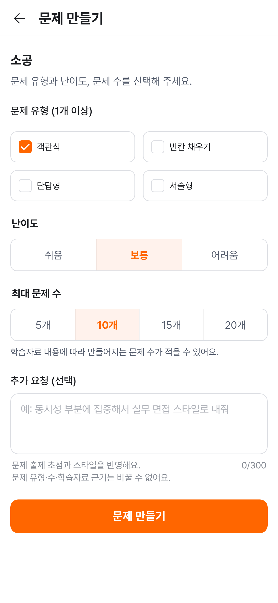
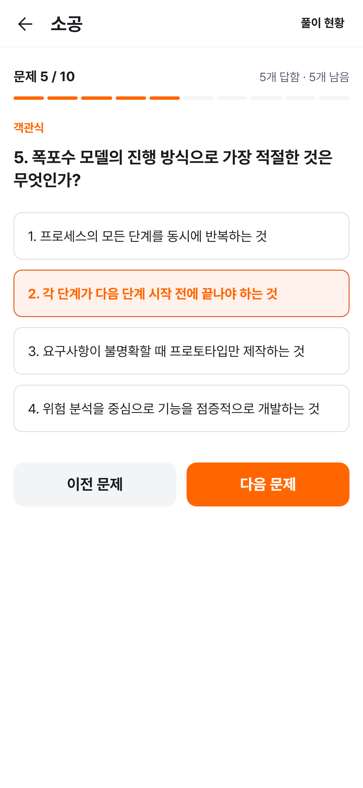
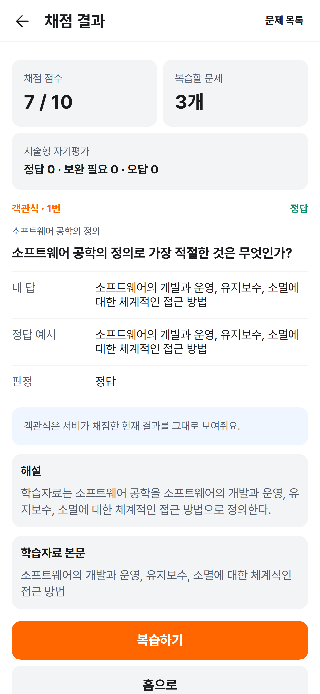
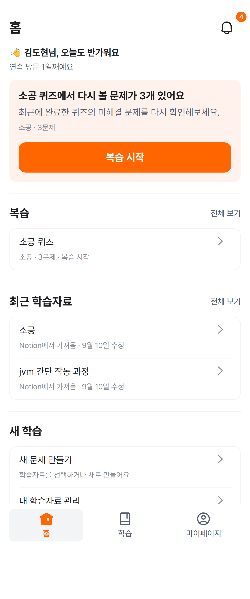

<div align="center">


Notion에 정리한 글이나 가지고 있던 텍스트를 학습자료로 가져와<br>
AI가 만든 문제를 풀고, 결과와 원문을 함께 확인하며 복습하는 학습 서비스입니다.

**[nalq.app에서 바로 시작하기 →](https://nalq.app)**

</div>

---

## 읽기에서 복습까지, 하나의 학습 흐름

글을 다시 읽는 것만으로는 내가 제대로 이해했는지 확인하기 어렵습니다.<br>
NalQ는 가지고 있던 글을 문제로 바꾸고, 직접 답을 떠올린 뒤 놓친 내용을 다시 확인하는 학습 루프를 만듭니다.

```text
학습자료 가져오기 → 문제 만들기 → 직접 풀기 → 결과 확인 → 틀린 문제 복습
```

<table>
  <tr>
    <td width="50%" valign="top">
      <h3>1. 원하는 조건으로 문제를 만들어요</h3>
      <p>문제 유형과 난이도, 문제 수를 내게 맞게 골라요.</p>
      <p align="center"></p>
    </td>
    <td width="50%" valign="top">
      <h3>2. 읽었던 내용을 직접 떠올려요</h3>
      <p>내 학습자료로 만든 문제를 풀며 이해를 확인해요.</p>
      <p align="center"></p>
    </td>
  </tr>
</table>

<table>
  <tr>
    <td width="50%" valign="top">
      <h3>3. 점수보다 놓친 내용을 확인해요</h3>
      <p>정답과 해설, 원문을 함께 보며 놓친 부분을 찾아요.</p>
      <p align="center"></p>
    </td>
    <td width="50%" valign="top">
      <h3>4. 다음에 할 학습을 바로 이어가요</h3>
      <p>홈에서 복습할 문제와 최근 학습을 바로 이어가요.</p>
      <p align="center"></p>
    </td>
  </tr>
</table>

---

## NalQ가 돕는 것

### 가지고 있던 글에서 시작합니다

텍스트를 붙여 넣거나 Notion 단일 페이지를 한 번 복사해 학습자료로 저장합니다. 새로운 교재를 다시 만들지 않고 이미 정리한 글에서 학습을 시작할 수 있습니다.

### 내 방식에 맞게 문제를 구성합니다

네 가지 문제 유형, 세 단계 난이도와 최대 `5`·`10`·`15`·`20`문제를 조합할 수 있습니다. 문제는 저장한 학습자료를 바탕으로 생성됩니다.

### 채점의 범위를 숨기지 않습니다

객관식·빈칸 채우기·단답형은 정해진 규칙으로 채점합니다. 서술형은 AI가 답을 단정하는 대신 모범 답안과 핵심 포인트를 보며 사용자가 `정답`·`보완 필요`·`오답`으로 직접 평가합니다.

### 오답을 다음 학습으로 연결합니다

결과에서 끝내지 않고 가장 최근에 완료한 퀴즈의 미해결 문제를 모아 다시 풀 수 있습니다.

| 학습자료 | 문제 구성 | 결과와 복습 |
| --- | --- | --- |
| 텍스트 붙여넣기 | 객관식 | 내 답과 정답 확인 |
| Notion 단일 페이지 복사 | 빈칸 채우기 | 해설 확인 |
|  | 단답형 | 관련 학습자료 본문 확인 |
|  | 서술형 | 틀린 문제 다시 풀기 |

---

## 서비스와 저장소

- **서비스:** [https://nalq.app](https://nalq.app)
- **구성:** React 웹, Spring Boot API, Expo 기반 모바일 앱 셸을 하나의 저장소에서 관리합니다.
- **제품 문서:** [NalQ 문서 지도](./docs/README.md)
- **문의:** nalq.service@gmail.com

```text
Browser ─────────────┐
                      ▼
                 Web ── API ──▶ Server ──┬──▶ MySQL
                      ▲                       └──▶ Redis
Mobile App ── WebView ─┘
```

| 영역 | 기술 |
| --- | --- |
| Web | React 19, TypeScript 6, Vite 8, React Router 7, TanStack Query 5, SEED Design |
| Server | Java 21, Spring Boot 4.1, Spring Data JPA, Spring Security, Flyway |
| Data | MySQL 8.4, Redis 7.4 |
| App | Expo SDK 57, React Native 0.86, React Native WebView |
| Test & Quality | JUnit 5, Testcontainers, Node.js Test Runner, TypeScript, Oxlint |

<details>
<summary><strong>로컬 개발 환경과 실행 방법</strong></summary>

### 사전 준비

- Java 21
- Node.js 22.12 이상
- pnpm 11.18.0
- Docker Desktop 또는 Docker Engine + Compose

### 인프라

```bash
cp .env.example .env
docker compose up -d
docker compose ps
```

### 서버

```bash
cd server
./gradlew test
./gradlew bootRun
```

기본 포트는 `8080`입니다. 필요한 환경 변수는 `server/.env.example`에서 확인할 수 있습니다.

### 웹

```bash
cd web
pnpm install
pnpm dev
```

기본 개발 서버는 `http://localhost:5173`입니다. API 주소는 `web/.env.example`의 `VITE_API_BASE_URL`로 설정합니다.

### 앱

```bash
cd app
pnpm install
pnpm start
# 또는 pnpm ios / pnpm android
```

WebView가 열 주소는 `app/.env.example`의 `EXPO_PUBLIC_WEB_URL`로 설정합니다.

</details>

<details>
<summary><strong>저장소 구조</strong></summary>

```text
NalQ/
├── server/  # Java 21, Spring Boot 4, Gradle
├── web/     # React, TypeScript, Vite, pnpm, SEED Design
└── app/     # Expo, React Native, TypeScript, pnpm
```

- `web/`은 인증, 홈, 학습자료, 퀴즈와 마이페이지의 사용자 화면과 상태를 담당합니다.
- `server/`는 인증, 학습자료, Notion 가져오기, 퀴즈 생성·채점·복습 API와 데이터를 담당합니다.
- `app/`은 NalQ 웹 서비스를 표시하고 네이티브 탐색과 오류 상태를 처리합니다.

</details>

<details>
<summary><strong>검증 명령</strong></summary>

```bash
./scripts/verify.sh fast  # 웹 정적 검증 + Testcontainers 제외 서버 테스트
./scripts/verify.sh all   # fast 검증 + Testcontainers 통합 테스트
```

| 대상 | 명령 |
| --- | --- |
| Web | `pnpm -C web verify` |
| Server fast | `./server/gradlew -p server fastTest` |
| Server integration | `./server/gradlew -p server integrationTest` |
| App | `pnpm -C app test && pnpm -C app typecheck` |
| Docker Compose | `docker compose config --quiet` |

</details>

<details>
<summary><strong>제품 및 개발 문서</strong></summary>

| 관심사 | 문서 |
| --- | --- |
| 제품 목적·범위·원칙 | [NalQ 제품 기반](./docs/product.md) |
| 학습자료 가져오기 | [학습자료 만들기 PRD](./docs/prd/prd-content-import.md) |
| 퀴즈 생성·풀이·결과·복습 | [퀴즈 PRD](./docs/prd/prd-quiz-learning.md) |
| 전체 문서와 구현 상태 | [NalQ 문서 지도](./docs/README.md) |

</details>

---

<div align="center">

**가지고 있던 글을, 오늘 풀어볼 문제로.**<br>
**[NalQ 시작하기](https://nalq.app)**

</div>
