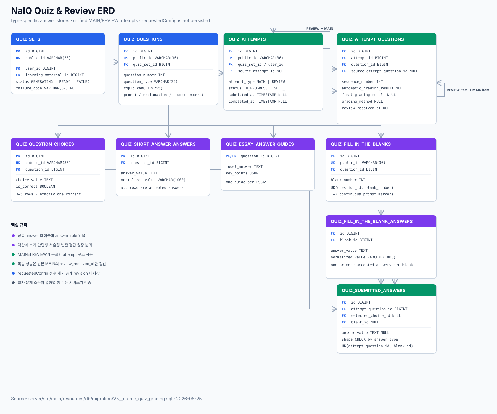

# [Data Contract] 학습자료와 퀴즈

- 소유 영역: 서버 학습자료·퀴즈·복습 도메인
- 관련 기능명세: [학습자료 만들기](../prd/prd-content-import.md), [퀴즈 생성·풀이·결과·복습](../prd/prd-quiz-learning.md)
- 관련 API: [학습자료·퀴즈·복습 API](contract-api-quiz-learning.md)

## 목적과 경계

학습자료와 원문 출처, 문제·정답 원장, 본 퀴즈와 복습 회차, 사용자 제출 답안과 채점 결과가 웹·앱·서버에서 같은 의미로 사용되도록 소유권과 생명주기를 정의한다. 물리 테이블과 컬럼은 서버 TRD와 migration이 책임지며 이 계약의 의미를 위반할 수 없다.

객관식 보기와 빈칸처럼 화면 렌더링에 필요한 문제 유형별 메타정보는 별도 설계 대상으로 남긴다. 이 문서는 정답·제출·채점·복습 관계만 확정한다.

## 공유 개념

- **문제 세트와 문제:** 한 번 생성된 문제 세트, 문제, 정답 기준과 원문 근거는 불변이다. 다시 생성할 때는 기존 문제를 수정하지 않고 새 문제 세트를 만든다.
- **문제 정답 원장:** 한 문제의 정답, 허용 답안과 서술형 예시 답안을 동일한 원장에 행 단위로 보존한다. 사용자 제출 답안과 분리한다.
- **풀이 회차(attempt):** 본 퀴즈와 복습을 공통으로 나타내는 사용자 소유 실행 단위다. `MAIN`은 원본 회차이고 `REVIEW`는 최초 `MAIN`을 원본으로 하는 재풀이 회차다.
- **회차 문항:** 한 회차에 포함된 문제를 고정한다. 복습을 시작할 때 대상 문제를 먼저 저장하므로 제출·채점 전에도 존재할 수 있다.
- **제출 답안:** 사용자가 실제 제출한 원문이다. 한 문항에 답안 행이 없으면 미응답이고, 복수 선택은 선택값마다 한 행을 가진다.
- **채점 결과:** 서버 최초 자동 채점과 현재 최종 판정을 구분한다. 복습은 원본 회차의 최초 제출·판정을 바꾸지 않고 해결 시점만 기록한다.

HTTP 필드 모양과 공개 오류는 [학습자료·퀴즈·복습 API](contract-api-quiz-learning.md)가 책임진다. 공개 `reviewSession` 리소스는 저장 모델에서 `attemptType=REVIEW`인 attempt이며 별도 복습 세션 원장을 만들지 않는다.

## 문제와 정답 원장

문제는 `questionType`을 가진다. 현재 지원 유형은 `MULTIPLE_CHOICE`, `FILL_IN_THE_BLANK`, `SHORT_ANSWER`, `ESSAY`다. 객관식 단일·복수 선택 구분과 보기 식별자, 빈칸 위치 식별자처럼 화면에 필요한 세부 메타정보는 후속 설계에서 확정한다.

각 정답 행은 다음 값을 가진다.

| 값 | 의미 |
| --- | --- |
| `answerValue` | 결과 화면에 사용할 원문. 서버가 정규화 문자열로 덮어쓰지 않음 |
| `normalizedValue` | 단답형 자동 채점에만 사용하는 비교값. 그 외 유형에서는 `null` 가능 |
| `answerRole=CORRECT` | 객관식 정답 선택값 또는 단답형 대표 정답 |
| `answerRole=ACCEPTED` | 단답형에서 추가로 인정하는 표현 |
| `answerRole=EXAMPLE` | 서술형 자기평가에 보여주는 예시 답안 |

복수 선택 정답은 배열이나 구분 문자열 하나로 저장하지 않고 정답 선택값마다 `CORRECT` 행을 하나씩 둔다. 단답형은 대표 `CORRECT` 한 행과 0개 이상의 `ACCEPTED` 행을 가진다. 서술형은 `EXAMPLE` 한 행을 가진다.

단답형 정답 원문과 사용자 제출 원문은 그대로 보존한다. 문제 저장 시 정답 원문의 `normalizedValue`를 계산하고, 채점 시 사용자 제출 원문을 같은 규칙으로 메모리에서 정규화해 비교한다. 내부 `normalizedValue`와 전체 허용 답안 목록은 클라이언트에 공개하지 않는다.

## 본 퀴즈와 복습 attempt

### 공통 상태

- `attemptId`: 클라이언트가 안전한 난수원으로 생성한 UUID다. 서버는 원문 UUID를 전역 unique 식별자로 저장하며 hash나 payload fingerprint를 만들지 않는다.
- `attemptType`: `MAIN` 또는 `REVIEW`다.
- `sourceAttemptId`: `MAIN`에서는 없고 `REVIEW`에서는 최초 `MAIN` attempt를 가리킨다. 복습끼리 연결하는 체인을 만들지 않는다.
- `status`: `IN_PROGRESS`, `SELF_ASSESSMENT_REQUIRED`, `COMPLETED`다.

본 퀴즈는 최종 제출 시 attempt와 회차 문항·제출 답안을 한 트랜잭션에서 확정한다. 복습은 시작 시 `IN_PROGRESS` attempt와 대상 회차 문항을 먼저 생성해 문항 snapshot을 고정하고, 모든 문항을 푼 뒤 한 번 제출·채점한다.

같은 사용자와 원본 `MAIN`에 미완료 `REVIEW`는 하나만 허용한다. 서버는 원본 `MAIN` attempt를 짧게 쓰기 잠금한 뒤 기존 미완료 복습 조회와 생성을 같은 트랜잭션에서 수행한다. 화면의 중복 클릭 방지는 이 서버 규칙을 대신하지 않는다.

### 회차 문항 연결

- `(attemptId, questionId)`는 한 번만 존재한다.
- `MAIN` 회차 문항은 `sourceAttemptQuestionId`가 없다.
- `REVIEW` 회차 문항은 최초 `MAIN`의 원본 회차 문항을 `sourceAttemptQuestionId`로 가리킨다.
- `REVIEW.sourceAttemptId`, 원본 회차 문항의 attempt와 양쪽 `questionId`가 모두 일치해야 한다.
- 이 연결 검증은 FK 존재 여부만으로 충분하지 않으므로 소유권 검증과 함께 서비스 트랜잭션에서 보장한다.

## 제출 답안

사용자 제출은 정답 원장과 별도 행으로 저장한다.

| 문제 유형 | 제출 답안 행 |
| --- | --- |
| 객관식 단일 선택 | 선택값 한 행 |
| 객관식 복수 선택 | 선택값마다 한 행 |
| 단답형 | 사용자 원문 한 행 |
| 서술형 | 사용자 원문 한 행 |
| 미응답 | 0행 |

사용자 제출 원문은 정규화 값으로 교체하지 않는다. 문제 유형별 답안 개수, 존재하는 선택값인지 여부와 중복 선택 방지는 제출 서비스가 검증한다.

## 채점 결과

회차 문항은 다음 채점 값을 가진다.

| 값 | 의미 |
| --- | --- |
| `automaticGradingResult` | 서버 최초 자동 판정. 객관식·빈칸·단답형에서 `CORRECT|INCORRECT`, 서술형에서는 `null` |
| `finalGradingResult` | 결과·복습 대상 계산에 사용하는 현재 최종 판정. `CORRECT|PARTIAL|INCORRECT` |
| `gradingMethod` | 최종 판정이 결정된 방식. `AUTOMATIC|USER_OVERRIDE|SELF_ASSESSMENT` |
| `reviewResolvedAt` | 원본 `MAIN` 오답이 복습에서 해결된 시각. 해결 전에는 `null` |

`gradingMethod`는 어떤 결과 컬럼을 선택하는 플래그가 아니다. 서비스와 조회는 항상 `finalGradingResult`를 현재 판정으로 사용하고, `gradingMethod`는 그 판정의 출처만 설명한다.

정상 조합은 다음과 같다.

- `AUTOMATIC`: 자동 판정과 최종 판정이 모두 있고 동일하다.
- `USER_OVERRIDE`: 자동 판정은 불변으로 남고 최종 판정만 사용자가 정한 값이다.
- `SELF_ASSESSMENT`: 자동 판정은 없고 최종 판정은 사용자 자기평가 결과다.
- 제출·채점 전: 세 값이 모두 없다.

MVP에서는 전체 사용자 수정 이력을 별도 테이블로 보존하지 않는다. 단답형 사용자 수정은 해당 사용자·attempt·문항의 `finalGradingResult`와 `gradingMethod`만 바꾸며 정답 원장이나 다른 attempt에 전파하지 않는다.

## 복습 대상과 해결

복습 후보는 최초 `MAIN` 회차 문항 중 현재 최종 판정이 `INCORRECT` 또는 `PARTIAL`이고 `reviewResolvedAt`이 없는 문항이다. 복습 attempt가 생기면 선택한 후보를 `REVIEW` 회차 문항으로 저장해 활성 복습의 문제 집합을 고정한다.

복습 문항을 맞히면 `REVIEW` 회차 문항의 `finalGradingResult=CORRECT`를 저장하고 원본 `MAIN` 회차 문항의 `reviewResolvedAt`을 같은 트랜잭션에서 기록한다. 원본의 `finalGradingResult`는 바꾸지 않아 “처음에는 틀렸지만 복습으로 해결함”을 보존한다. 다시 틀리거나 부분 정답이면 원본 `reviewResolvedAt`을 비워 두어 다음 복습 후보로 남긴다.

## 트랜잭션과 불변성

- 본 퀴즈 제출은 attempt, 회차 문항, 제출 답안과 채점 결과를 한 트랜잭션에서 저장한다.
- 복습 시작은 원본 `MAIN` 잠금, 미완료 `REVIEW` 확인과 snapshot 생성을 한 트랜잭션에서 처리한다.
- 복습 제출은 제출 답안, 복습 채점과 원본 `reviewResolvedAt` 갱신을 한 트랜잭션에서 처리한다.
- 같은 UUID 재요청은 먼저 확정된 attempt를 반환하고 request hash·fingerprint·replay 테이블을 만들지 않는다.
- 한 번 attempt가 연결된 문제 세트·문제·정답 원장은 수정하거나 물리 삭제하지 않는다.

## 생명주기

- 정답 원장은 문제와 같은 생명주기를 가진다.
- 회차 문항, 제출 답안과 채점 결과는 attempt와 같은 생명주기를 가진다.
- `REVIEW` attempt는 최초 `MAIN`을 참조하므로 원본을 먼저 물리 삭제하지 않는다.
- 향후 계정·학습자료 삭제 정책을 정할 때 본 퀴즈와 복습 이력도 함께 삭제·익명화하거나 보존 기간을 명시해야 한다.

## 열린 질문

- 객관식 보기 문구·식별자와 단일·복수 선택 모드를 어떤 구조로 전달·저장할지
- 빈칸 위치와 빈칸별 정답을 어떤 식별자로 연결할지
- 사용자 계정이나 학습자료를 삭제할 때 파생 문제 세트와 풀이 이력을 삭제·익명화·기간 보존 중 어떻게 처리할지
- 생성·채점 모델과 평가 근거를 어느 수준까지 추적해야 결과를 재현하고 감사할 수 있는지

위 질문은 화면 계약이나 데이터 보존 범위를 바꾸므로 후속 설계에서 확정한다. 성능 개선용 보조 인덱스는 현재 SQL 범위에 포함하지 않는다.
