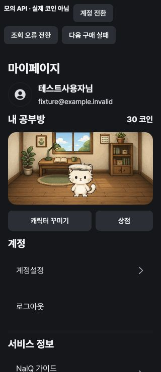
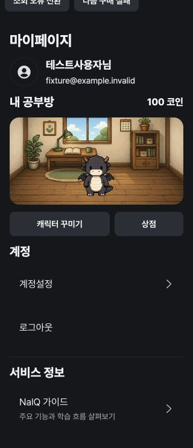

# 캐릭터 상점 UI 검증 — 2026-09-08

로컬 개발 서버의 `/tests/browser/character-shop.html`에서 실제 화면 컴포넌트와 모의 Axios adapter를 연결했다. 테스트 계정과 잔액은 fixture이며 실제 서버 지급·DB 저장의 증거로 사용하지 않는다. 기능 도입 전 완료 세트는 소급 보상하지 않는다.

## 확인한 시나리오

- PASS: 마이페이지 → 상점 → 고양이 구매 확인(100코인 중 50) → 잔액 50 및 보유 갱신.
- PASS: 베레모 구매 실패를 주입했을 때 잔액 유지·오류 안내. 같은 확인 버튼을 Enter로 재시도한 뒤 잔액 30·보유 갱신.
- PASS: 꾸미기에서 보유 고양이·베레모 선택 → 미저장 안내 → 저장 → 마이페이지에 고양이·베레모 조합 반영.
- PASS: 다른 fixture 계정으로 전환하면 0코인·기본 용·모자 없음으로 분리되며 잔액 부족 상품은 구매 불가.
- PASS: 조회 실패 상태의 오류와 다시 시도 버튼. 기존 계정·서비스 메뉴 유지.
- PASS: 320px 마이페이지와 상점에서 document/main scrollWidth가 모두 320px. 390px에서 상품 목록·구매 확인·장착 화면 확인.
- PASS: `/profile/shop` 직접 진입 → 꾸미기 → 뒤로가기에서 마이페이지 복귀. 1440px 화면의 콘텐츠 최대 너비 640px.
- PASS: SEED 탭과 구매 확정 키보드 조작. 자동 캐릭터 모션 없음.

## 스크린샷

두 이미지의 상단 조작 버튼은 UI 검증 fixture에만 있으며 실제 제품에 포함되지 않는다.

## 별도 검증 경계

- 실제 DB 검증: 서버 fastTest 353/353, integrationTest 78/78, 최종 영향 통합 34/34 PASS. 전체 test 묶음은 기존 Redis TTL 검사에서 20,000ms 상한 대비 20,001ms 타이밍 실패 1건이 있었고 단독 재실행 PASS였다. UI fixture 결과와 구분한다.
- 물리 iOS/Android WebView에서 직접 조작한 검증은 수행하지 않았다.
- 원본 합성 PNG를 재사용했으며 아티스트가 만든 정식 걷기 atlas는 포함하지 않는다.
